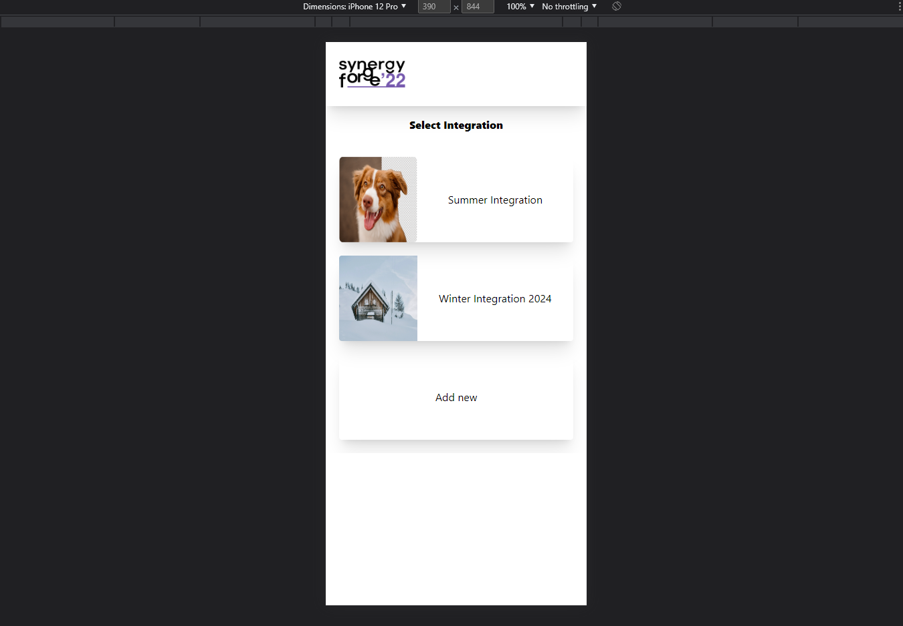

# SynergyProject

Frontend Aplication which make easier to create integration Budget for companies.
The idea for this project was taken from workshop.

## TechStack
- Angular 
- TypeScript

## Installation and Usage Instructions
1. To app work corectly you have to run first backendSynergyProject.
3. Make sure that you are in apropriate directory, write "npm install" in terminal and wait till installed all package.
4. In terminal write "ng serve" and in your browser open http://localhost:4200/.

## Screenshots
The diffrence look between mobile view and computer view.

  
  

  
  

  
  

  
  

  
  

